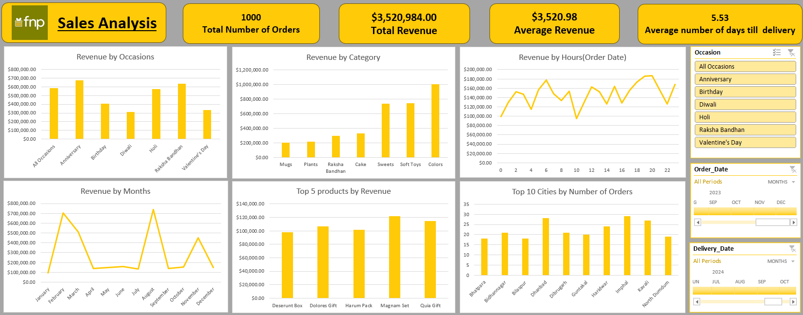

# FNP Sales Analysis Dashboard

## Project Overview
This project presents a **Sales Analysis Dashboard** built in Microsoft Excel for FnP (Ferns N Petals).  
The dashboard provides interactive visual insights into sales performance across different dimensions such as occasions, categories, time periods, products, and locations.  

It is designed to help stakeholders quickly understand key metrics and trends, supporting better decision-making for sales and operations.

---

## Features
- **Key Metrics Overview**
  - Total Number of Orders  
  - Total Revenue  
  - Average Revenue  
  - Average Number of Days till Delivery  

- **Visual Analysis**
  - Revenue by Occasions  
  - Revenue by Category  
  - Revenue by Hours (Order Date)  
  - Revenue by Months  
  - Top 5 Products by Revenue  
  - Top 10 Cities by Number of Orders  

- **Interactive Filters (Slicers)**
  - Occasion filter  
  - Order Date filter  
  - Delivery Date filter  

---

## Tools and Techniques Used
- Microsoft Excel 2019  
- Pivot Tables and Pivot Charts  
- Slicers for interactivity  
- Data cleaning and preparation  
- Dynamic charting and formatting  

---

## Datasets
Three datasets were used for this analysis:
1. **Orders dataset** – contains order-level details including dates and occasions.  
2. **Products dataset** – includes product information and categories.  
3. **Delivery dataset** – includes delivery timelines and completion details.  

The datasets were cleaned and combined to enable comprehensive sales analysis.  

---

## Key Insights
- Certain occasions (like **Anniversary** and **Raksha Bandhan**) contribute significantly to revenue.  
- Specific categories (such as **Colors**, **Sweets**, and **Soft Toys**) drive the highest sales.  
- Sales patterns vary across months, with peaks in **March** and **September**.  
- Revenue distribution across cities highlights key markets driving order volumes.  

---

## File Structure
- `Excel Dashboard Project.xlsx` – Main Excel dashboard file  
- `Dashboard.png` – Preview image of the dashboard  
- `Datasets Folder` - Contains all the datasets used
---

## Dashboard Preview

---

## How to Use
1. Download the Excel file from this repository.  
2. Open in **Microsoft Excel 2019 or later**.  
3. Use the interactive slicers on the right side to filter data by **Occasion**, **Order Date**, or **Delivery Date**.  
4. Explore dynamic updates across all charts and metrics.  

---

## Conclusion
This project demonstrates the use of **Excel as a BI tool** for analyzing sales data and creating interactive dashboards.  
It highlights the importance of **visualization and interactivity** in identifying patterns and supporting business decisions.  
